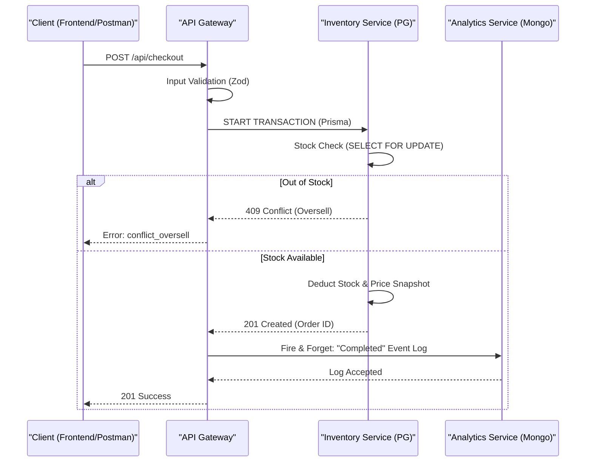

# AURA Jewellery - E-Commerce Platform (Polyglot Microservices)

A comprehensive, feature-rich e-commerce platform for luxury jewellery. The project consists of a modern Single Page Application (React) and a highly robust, microservices-based backend utilizing a Polyglot Persistence architecture (PostgreSQL + MongoDB).

---

# 🏗️ Part 1: Backend Architecture & Database Design

The backend system is designed for a kiosk ordering point and implements the **Saga Pattern** to ensure hybrid consistency across relational and document databases.

### Microservices Breakdown
1. **API Gateway (Port 3000):** The central entry point. Handles request validation (Zod), routing, distributed transaction orchestration, and OpenAPI documentation.
2. **Inventory & Order Service (PostgreSQL - Port 3001):** Manages strictly transactional data: product catalog, stock levels (with oversell protection locks), server-side carts, and order creation with price snapshots.
3. **Catalog & Analytics Service (MongoDB - Port 3002):** Handles flexible document data: extended product details, specifications, user reviews, cart drafts, and checkout telemetry events for server-side analytics.

### Data Flow Diagram (Hybrid Checkout Saga)
The following Mermaid diagram illustrates the distributed transaction during checkout, ensuring cross-database consistency between PostgreSQL and MongoDB.



## 🚀 Running the Backend (Docker Compose)

The entire ecosystem (microservices + databases) is fully containerized and requires no manual setup.

1. Clone the repository and navigate to the project folder:
```
git clone https://github.com/zofiadobrowolskaa/ecommerce-spa.git
cd ecommerce-spa
```

2. Ensure Docker and Docker Compose are installed.

3. Create a ```.env``` file in the root directory (see variables below).

4. Spin up the infrastructure:
```docker compose up -d --build```

5. Access the System

- **API Gateway:** ```http://localhost:3000``` 
- **Swagger UI (OpenAPI Docs):** ```http://localhost:3000/api-docs```  
- **Inventory Service (Internal):** ```http://localhost:3001  ```
- **Catalog Service (Internal):** ```http://localhost:3002```

## ⚙️ Environment Variables (.env)
Required configuration for the container orchestration:

```
# database credentials
POSTGRES_USER=user
POSTGRES_PASSWORD=password
POSTGRES_DB=ecommerce_db
MONGO_INITDB_ROOT_USERNAME=admin
MONGO_INITDB_ROOT_PASSWORD=password

# service ports
API_GATEWAY_PORT=3000
INVENTORY_SERVICE_PORT=3001
CATALOG_SERVICE_PORT=3002
FRONTEND_PORT=5173
```

## 📡 API Documentation (OpenAPI / Swagger)
The system exposes a fully interactive **OpenAPI 3.0** REST contract. It documents all available endpoints, query parameters, required request bodies (schemas), and expected HTTP responses.
* **Access:** Once the containers are running, navigate to `http://localhost:3000/api-docs` to access the Swagger UI.

## 🛠️ Database Technologies & ORMs (Polyglot Implementation)
To demonstrate proficiency across multiple database interaction paradigms, the backend implements distinct drivers and ORMs for specific bounded contexts:

**PostgreSQL (Relational):**
1. **`pg` native driver:** Manages high-performance inventory stock deductions and explicit HTTP error mapping.
2. **Knex.js:** Handles database schema migrations, initial seed data, and dynamic SQL query building for the product catalog filtering.
3. **Sequelize v6:** Manages the server-side shopping cart state with schema validation and eager loading.
4. **Prisma ORM:** Orchestrates complex checkout transactions, order creation, and executes raw SQL queries (`$queryRaw`) for reporting.

**MongoDB (Document):**

5. **MongoDB Native Driver:** Fast, low-overhead insertions for the telemetry and analytics event log via Singleton connection.
6. **Mongoose:** Manages complex nested schemas, custom validations, and hooks for product details and reviews.
7. **Aggregation Pipeline:** Utilized directly in the database engine to perform advanced analytics and grouping on sales data.

## 🛡️ Security & Threat Mitigation (Threat Modeling)

The system enforces multiple security layers:

### 1. 🔐 Input Validation
All incoming requests are strictly validated using **Zod schemas** before reaching the database, preventing NoSQL/SQL injection and ensuring data integrity.

### 2. 🚫 Stack Trace Hiding
Global error handlers encapsulate internal crashes.  
Express stack traces never leak to the client and are mapped to generic HTTP error messages.

### 3. 🧾 Explicit Database Error Handling
Native PostgreSQL errors are safely mapped:

- `23505` (Unique Violation) → `409 Conflict`
- `23503` (Foreign Key Violation) → `400 Bad Request`

### 4. ⚠️ Threat Mitigations

### 🧨 Race Conditions (Overselling)
Eliminated using strict row-level locking (`FOR UPDATE`) inside interactive Prisma transactions during checkout.

### 🔄 Inconsistent State (Distributed Systems)
Handled via the **Saga Pattern**. If the hybrid product creation fails in Mongo, a rollback (compensation) is triggered in Postgres.

## 🧪 Automated E2E Testing

The repository includes a comprehensive End-to-End test suite using **supertest**.

During CI/CD (GitHub Actions), a dedicated isolated database container is spun up to verify critical system paths.

### ✅ Covered Critical Paths

- Fetching initial stock levels  
- **Oversell protection** → forcing `409 Conflict` when requesting more stock than available  
- Successful checkout finalization  
- Strict verification of stock reduction  
- Stock restoration after order cancellation  
- Hybrid product creation saga (Postgres + MongoDB)  
- Zod validation failure rejection  

Run tests locally:

```docker exec -it spa-api-gateway-1 npm run test:e2e```


# 💻 Part 2: Frontend Client (SPA)

A modern Single Page Application built with **React and Vite**, serving as the storefront for the backend infrastructure. It features a complete customer storefront and an admin management panel.


## 🛍️ Customer Features

- **Product Catalog**
  - Browse 18+ premium jewellery products across 4 categories (Rings, Necklaces, Earrings, Bracelets)
  - Advanced filtering by category, price range, rating, and search keywords
  - Product variants with color and size options
  - Detailed product pages
  - Related product recommendations
  - URL-synced filters and pagination for shareable links

- **Shopping Experience**
  - Intuitive shopping cart with variant and size tracking
  - Cart persistence using LocalStorage
  - Promo code system (use `AURA20` for 20% discount)
  - Real-time price calculations

- **Checkout Process**
  - Multi-step checkout wizard (4 steps)
  - Personal details collection with validation
  - Shipping method selection (Standard $5 / Express $15)
  - Payment information capture
  - Order summary and confirmation
  - Order history in user profile

- **User Authentication**
  - Registration and login system
  - User profile management
  - Order history tracking
  - Protected routes for authenticated users

## 🛠️ Admin Features

- **Analytics Dashboard**
  - Key metrics overview (total orders, revenue, active products)
  - Sales by category visualization (bar chart)
  - Revenue over time tracking
  - Order management with date range filtering
  - Order deletion capabilities

- **Product Management**
  - Full CRUD operations for products
  - Variant management (colors, sizes, images, price adjustments)
  - Complex product form with comprehensive validation
  - Pagination (10 products per page)
  - Factory reset to restore default data

- **Development Tools**
  - Role switcher for testing different user perspectives

## ⚙️ Tech Stack (Frontend)

- **Framework:** React 18.3.1, React Router DOM 7.1.1, Vite 6.0.5  
- **Styling:** SASS  
- **Form Management:** Formik, Yup, React Hook Form  
- **UI Libraries:** React Hot Toast, Lucide React, Recharts  

## 💻 Frontend Installation & Usage
If running outside of Docker Compose, you can start the frontend independently:
```
cd frontend
npm install
npm run dev
```

Navigate to ```http://localhost:5173```

## 🧭 Routing Structure

### Client Routes
- `/` - Home page with hero section and categories
- `/products` - Product list with filtering
- `/products/:id/:variantId` - Product details
- `/cart` - Shopping cart
- `/checkout` - Multi-step checkout
- `/order-confirmation/:id` - Order success page
- `/account` - Login/Register/Profile

### Admin Routes
- `/admin` - Redirects to dashboard
- `/admin/dashboard` - Analytics dashboard
- `/admin/products` - Product management interface


## ⚠️ Disclaimer

This project is created strictly for **educational purposes** to demonstrate technical skills in React and SPA development. It is **not** intended for commercial use.

The visual identity, product imagery, and descriptions are sourced from and inspired by **[Steff Eleoff](https://steffeleoff.com)**. I do not claim ownership of these assets; all intellectual property rights belong to their respective owners.